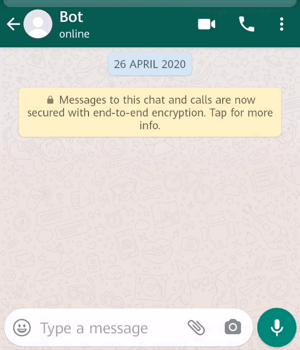
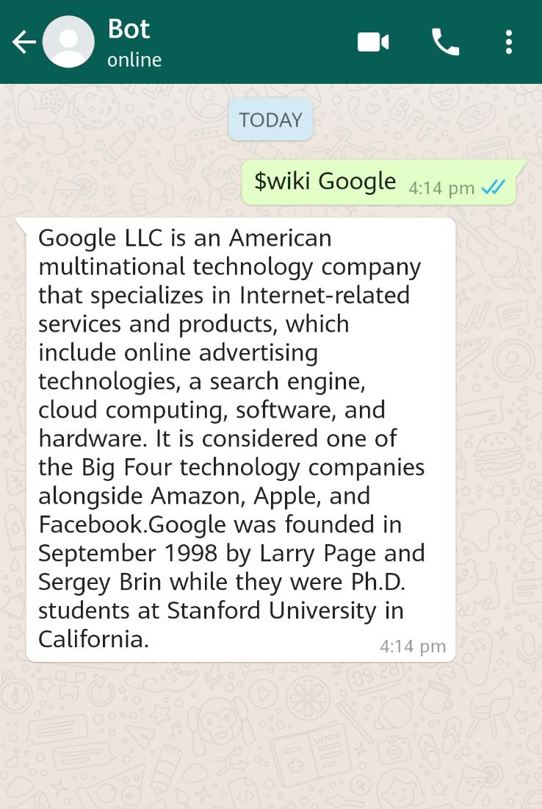

# Whatsapp-bot

A selenium based WhatsApp Web bot developed in Python.

 

## Features:

1. **Completely customizable:** you can add/remove/modify any command you want easily
```python
# in the func.py file
def yourCommand():
    return "Your Response"
```
2. **Easy to use:** simply scan the QR code with your number and you're good to go!

3. **Can be added to group chats!** most WhatsApp Bots can only be messaged directly, this isn't the case here :) 

4. **Undetectable**: you don't need to worry about your number being banned from whatsapp.
## Installation

1. clone the repository using :
```bash
git clone https://github.com/M7mdisk/whats-bot.git
```
2. move to the cloned directory: `cd whats-bot`.

3. Install the required libraries using `pip`:
```bash
pip install -r requirements.txt
```
## Usage
_**TEMPORARY: you need to create an empty group called "ASDFGHJKL" and add the bot to it, you can leave it after that (this is just so the bot can receive unread messages and doesn't stay on the same chat)**_
```
$ python3 main.py
```
wait for the driver to run, scan the QR Code as instructed.
Enjoy the bot :)

### Commands
*These commands are used in WhatsApp (messaging the bot)* You can modify them as desired in the `func.py` file.
* **$help:** print a list of all the command.
* **$echo:** Repeats what you say.
* **$weather [city]:** returns weather and temperature in given location.
* **$youtube [subject]:** returns first youtube search result for given subject.
* **$wiki [topic]:** returns short summary on given topic _needs to be a title of a wikipedia article or else won't work_.
* **$quote:** returns famous quote.
* **$random:** returns random useless fact.
* **$flip:** flips a coin.

## Contributing
Pull requests are welcome. For major changes, please open an issue first to discuss what you would like to change.

Please make sure to update tests as appropriate.

## License
[MIT](https://choosealicense.com/licenses/mit/)
